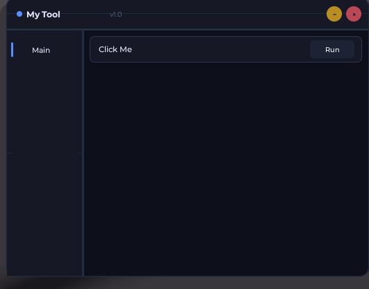

[](README.md)
[](README.ru.md)



# Features
* Creating in-game components such as windows, buttons and etc.
* Toggles and buttons with functionality
* And more...

# Installation
To install and use this UI Library simply just paste this line of code at the top of your script;

```lua
local NovUI = loadstring(game:HttpGet("https://raw.githubusercontent.com/shmoti-arch/NovUI/refs/heads/main/LIB"))()
```
